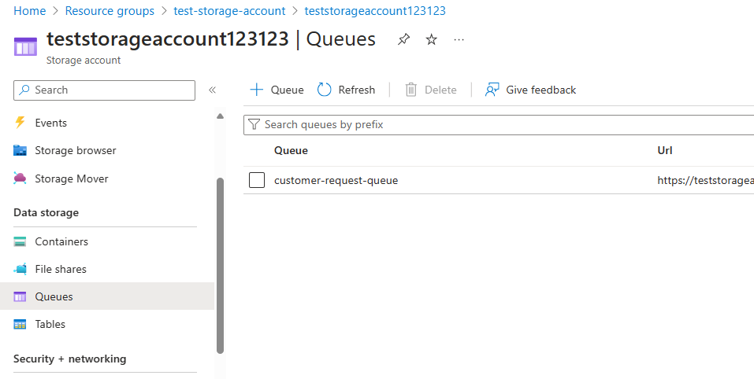
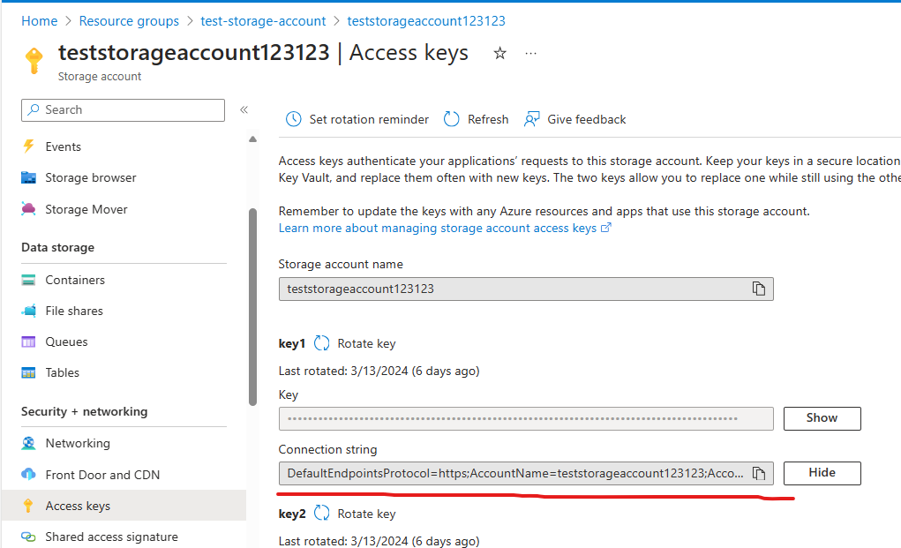

### Preparation
* Need to create a Queue in Storage account on Azure


* Need to get connection string 


* Add following dependency in pom.xml
```xml
        <dependency>
            <groupId>com.azure</groupId>
            <artifactId>azure-storage-queue</artifactId>
        </dependency>
```

* Replace `azure.storage.connection.string` properties to your queue connection string
```properties
azure.storage.connection.string={{QUEUE_CONNECTION_STRING}}
```

* Need to instantiate QueueClient
```java
    public AzureQueueService(@Value("${azure.storage.connection.string}") String connectionString,
                             @Value("${azure.storage.queue-name}") String queueName){
        this.queueClient = new QueueClientBuilder()
                .connectionString(connectionString)
                .queueName(queueName)
                .buildClient();
    }
```

* Then use queueClient to send and receive the message in queue
```java
    public void sendMessage(String message){
        queueClient.sendMessage(message);
    }

    public String receiveMessage(){
        return queueClient.receiveMessages(1).stream()
                .findFirst()
                .map(message -> {
                    queueClient.deleteMessage(message.getMessageId(), message.getPopReceipt());
                    return message.getMessageText();
                }).orElse(null);
    }
```
